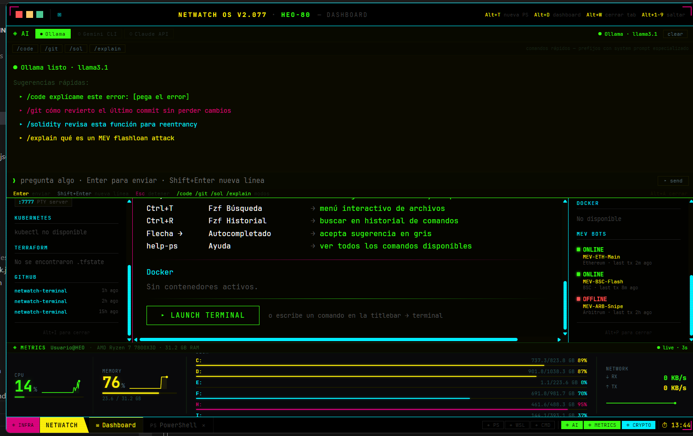
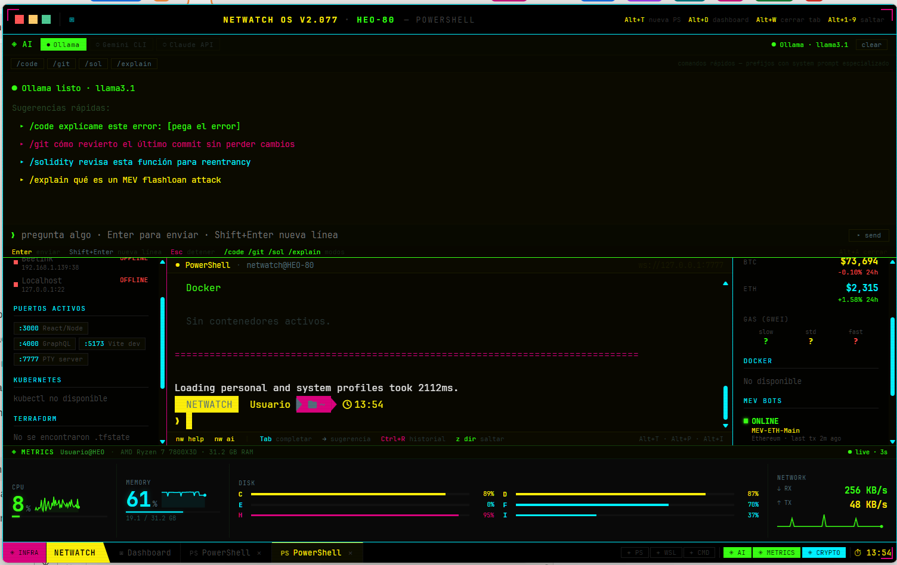
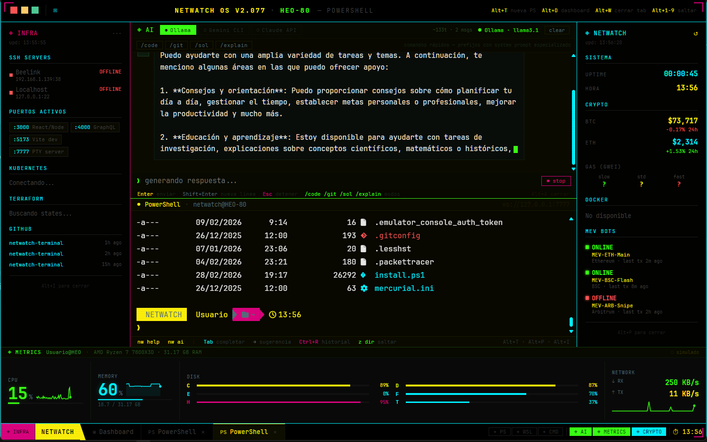

<div align="center">

<br/>



<br/>
<br/>

# NETWATCH OS v2.077

### Cyberpunk terminal environment for developers.

AI-powered · Real-time metrics · Multi-shell · Crypto dashboard · MEV bot monitoring

<br/>

[](https://tauri.app/)
[](https://react.dev/)
[](https://www.rust-lang.org/)
[](https://developer.mozilla.org/en-US/docs/Web/JavaScript)
[](https://learn.microsoft.com/en-us/powershell/)
[](https://soliditylang.org/)

<br/>

</div>

---

<div align="center">



<br/>
<br/>



</div>

---

<div align="center">

## 🖥️ What is NETWATCH?

</div>

NETWATCH is a fully custom terminal environment built as a native Windows app. It replaces the default terminal with a cyberpunk-themed workspace that integrates AI assistants, real-time system metrics, crypto prices, infrastructure monitoring and MEV bot status — all in a single interface with keyboard-driven navigation.

No Electron. No browser tab. A native **Tauri** app with a **Rust PTY server** running real shells.

---

<div align="center">

## ⚡ Architecture

</div>

```
Tauri (Rust backend)
  ├── PTY Server       ws://127.0.0.1:7777   — real shell processes via WebSocket
  └── invoke()         run_powershell         — system metrics via WMI queries

React (frontend)
  ├── App.jsx          — layout, global state, keyboard shortcuts
  ├── AIPanel          — collapsible AI panel (Ollama / Gemini / Claude)
  ├── MetricsPanel     — live system metrics (CPU, RAM, Disk, Network)
  ├── InfraPanel       — left sidebar (SSH, ports, K8s, Terraform, GitHub)
  ├── SidePanel        — right sidebar (Crypto, Gas, Docker, MEV Bots)
  ├── Dashboard        — home screen with system info and shortcuts
  └── Terminal         — xterm.js instances connected to PTY server
```

---

<div align="center">

## 🛠️ Tech Stack

| Layer | Technology |
|-------|-----------|
| Desktop app | [Tauri v2](https://tauri.app/) |
| Backend / PTY | [Rust](https://www.rust-lang.org/) + node-pty |
| UI | [React 18](https://react.dev/) + Vite |
| Terminal emulator | [xterm.js](https://xtermjs.org/) |
| Styling | CSS Variables + inline styles |
| Font | [JetBrains Mono Nerd Font](https://www.nerdfonts.com/) |
| AI local | [Ollama](https://ollama.ai/) |
| AI cloud | Gemini API · Claude API |
| Build | [Vite 5](https://vitejs.dev/) |

</div>

---

<div align="center">

## 🎛️ Panels & Keyboard Shortcuts

| Shortcut | Action |
|----------|--------|
| `Alt+A` | Toggle AI panel |
| `Alt+M` | Toggle Metrics panel |
| `Alt+I` | Toggle INFRA panel (left) |
| `Alt+P` | Toggle CRYPTO panel (right) |
| `Alt+T` | New PowerShell tab |
| `Alt+W` | Close active tab |
| `Alt+D` | Go to Dashboard |
| `Alt+1–9` | Jump to tab by number |

</div>

---

<div align="center">

## 🤖 AI Panel

</div>

Three providers, one interface.

| Provider | Type | Requirements |
|----------|------|-------------|
| **Ollama** | Local | Ollama installed — no API key, no internet |
| **Gemini CLI** | Cloud | `GEMINI_API_KEY` in localStorage |
| **Claude API** | Cloud | `ANTHROPIC_API_KEY` in localStorage |

**Quick commands with specialized system prompts:**

| Command | Focus | Use case |
|---------|-------|----------|
| `/code` | Senior dev, clean output | Review or write code |
| `/git` | Expert, exact command first | Git flows |
| `/sol` | Smart contract auditor, MEV & DeFi | Solidity contracts |
| `/explain` | Technical, concise, senior level | Concepts and errors |

---

<div align="center">

## 📊 Metrics Panel

</div>

Live system data refreshed every 3 seconds via Tauri `invoke("run_powershell")`.

| Section | Data |
|---------|------|
| **CPU** | Usage % + 50-point sparkline |
| **Memory** | Usage % + GB used/total + sparkline |
| **Disk** | All drives auto-detected, 2-column layout, color alerts |
| **Network** | RX/TX KB/s or MB/s + sparkline |

Color alerting: 🟢 green → 🟡 yellow (>75%) → 🔴 red (>90%)

---

<div align="center">

## 🎨 Design System

One color, one meaning. Always.

| Color | Hex | Meaning |
|-------|-----|---------|
| Yellow | `#FCEE0A` | NETWATCH identity, titles |
| Green | `#39FF14` | Success, bash, AI, Metrics |
| Cyan | `#00F0FF` | Paths, info, CMD, CRYPTO |
| Magenta | `#D9027D` | Git, actions, PS shell |
| Red | `#ff5555` | Errors only |
| BG | `#080700` | Main background |

</div>

---

<div align="center">

## 🚀 Quick Start

</div>

```bash
# 1. Prerequisites: Node.js 18+, Rust, Tauri CLI
npm install -g @tauri-apps/cli

# 2. Install dependencies
npm install
cd frontend && npm install

# 3. Run in development
npm run dev
```

**Configure AI providers (optional):**
```javascript
// In browser devtools console
localStorage.setItem('nw-gemini-key', 'YOUR_GEMINI_API_KEY')
localStorage.setItem('nw-claude-key', 'YOUR_ANTHROPIC_API_KEY')
// Ollama works out of the box if installed
```

---

<div align="center">

## ✅ Status

| Feature | Status |
|---------|--------|
| Boot screen animation | ✅ |
| Multi-tab (PowerShell, WSL, CMD) | ✅ |
| AI panel — Ollama, Gemini, Claude | ✅ |
| Quick commands `/code /git /sol /explain` | ✅ |
| Persistent AI history | ✅ |
| Live metrics (CPU, RAM, Disk, Network) | ✅ |
| Multi-drive disk detection | ✅ |
| INFRA panel | ✅ |
| CRYPTO panel + MEV Bots | ✅ |
| Full-height side panels | ✅ |
| Gas (Gwei) live API | ⏳ |
| SSH connect from INFRA panel | ⏳ |

</div>

---

<div align="center">

## 🧑‍💻 Author

**Héctor Oviedo** — Full Stack Dev & DeFi Researcher · Zaragoza, España

[](https://linkedin.com/in/hectorob)
[](https://github.com/HEO-80)

<br/>

*NETWATCH OS v2.077 · Built with Tauri + React + Rust · Héctor Oviedo · Zaragoza, España*

<br/>

</div>
